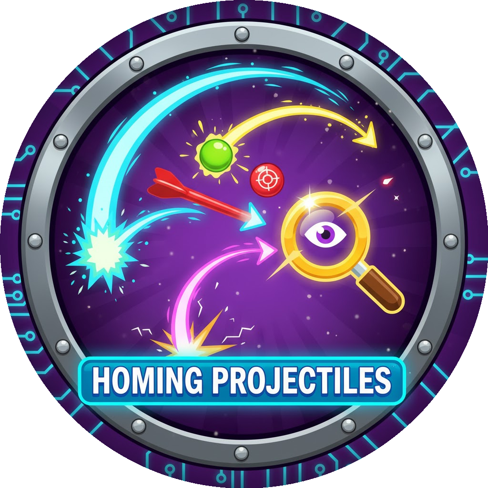

<h1 align="center">

</h1>
<h3 align="center">Makes all straight-traveling projectiles seek targets like ninja monkey projectiles</h3>
<h1 align="center">All Seeking Projectiles</h1>

## Features

- Adds seeking behavior to all straight-traveling projectiles
- Toggle on/off with F9 hotkey
- Toggle via in-game mod settings menu
- Smart exclusions for towers that shouldn't seek (Ice Monkey, Sniper, Mortar, Spike Factory)
- Works with abilities that shoot projectiles
- Fix from an old **Timotheeee** mod.

## Compatibility

- Works on BTD6 version **51.2**
- Requires BTD6 Mod Helper
