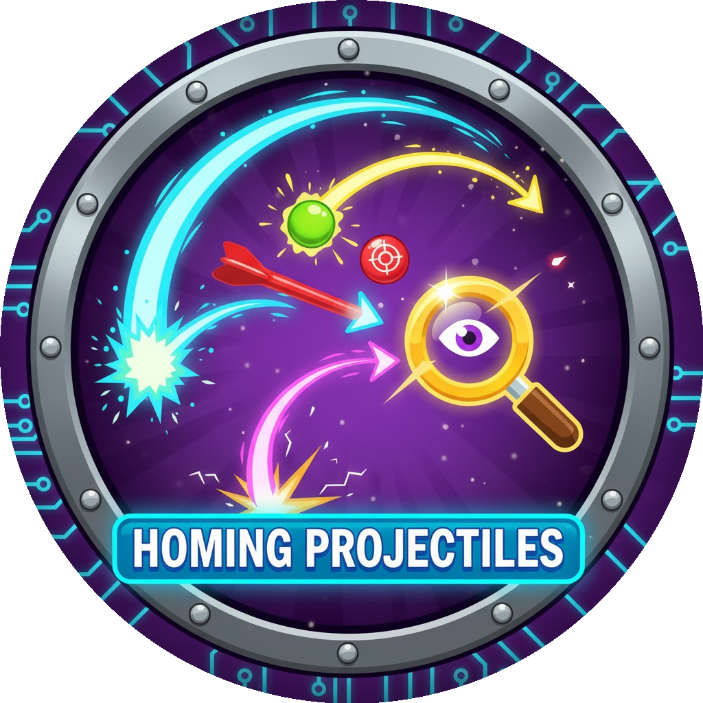

<h1 align="center">

</h1>
<h3 align="center">Makes all straight-traveling projectiles seek targets with multiple options.</h3>
<h1 align="center">All Seeking Projectiles</h1>

## Features

- Seeking behavior on all projectiles (F9 to toggle)
- Adjustable turn speed, pierce bonus, infinite range, and wall/collision bypass
- Works with tower abilities

## Compatibility

- BTD6 version **53.2**
- Requires BTD6 Mod Helper
